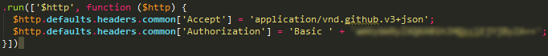
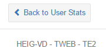

# TWEB TE2
## Introduction
Le but de ce travail écrit est de réaliser une application web offrant de la visualisation graphique d'informations récupérées sur une API (GitHub, StackExchange, CrunchBase) ou alors d'étudier le mécanisme de sécurité CORS selon le sujet choisi.

Voici les 4 sujets proposés :

- **Sujet 1:** Développer une application AngularJS pour afficher du contenu obtenu via l'API 
- **Sujet 2:** Développer une application AngularJS pour afficher du contenu obtenu via l'API GitHub
- **Sujet 3:** Développer une application AngularJS pour afficher du contenu obtenu via l'API CrunchBase
- **Sujet 4:** Développer une application AngularJS pour illustrer le fonctionnement du mécanisme CORS

J'ai choisi le *sujet 2*.

## Lien heroku de l'application
L'application est disponible à l'adresse suivante : [https://tweb-git-stats-te2.herokuapp.com/](https://tweb-git-stats-te2.herokuapp.com/)

##Étude "API Github"
L'API github est disponible à l'URL suivante : [https://api.github.com](https://api.github.com).

La documentation complète de l'API peut être visualisé à l'adresse suivante : [Documentation Developper](https://developer.github.com/v3/).

###Possibilitée(s)
Il est possible, depuis cette API, tout d'abord, d'effectuer des recherches, d'utilisateurs, de dépots. Également, à l'aide du nom de login de l'utilisateur, on peut récupérer des informations plus précises à propos de l'utilisateur, des informations sur ces dépôts et autres statistiques.

###Limite(s)

L'API Github possède une limite en terme de nombre de réquètes par adresse ip selon deux cas :

1. Identifié : *5,000 requêtes par heure*
2. Non-identifié : *60 requêtes par heure*  

Il est donc nécessaire de s'authentifier pour que notre application ne soit pas handicapée par cette limite. J'ai utilisé des requêtes utilisant la **Basic Authentification**.

##Spécification
Avant de passer à la partie développement concrète, voici la spécification de ce que je penses réaliser :

L'application sera réalisée en trois phases :

1. Recherche d'un utilisateur GitHub
2. Statistiques sur un utilisateur
3. Statistiques sur un dépot 

##Implémentation technique
Pour commencer, je suis parti du générateur yeoman **Angular** proposé par la team Yeoman justement.

### Générateur Yeoman 
Ce projet a été généré à l'aide de la commande [yo angular generator](https://github.com/yeoman/generator-angular)
version 0.15.1.
#### Compilation & développement

Utilisez `grunt` pour compiler et  `grunt serve` pour afficher.

#### Test

Utilisez `grunt test` pour lancer les procédures de test avec Karma.

#### Authentification
Pour passer en mode authentifié et profiter des 5,000 requêtes par heure, je me suis basé sur des requêtes **Basic Authentification** dont voici l'implémentation technique :

On donne le token qu'on peut récupérer sur GitHub.
### Gestion des routes
De base, le générateur nous propose l'utilisation de **ngRoute**. J'ai utilisé **ui-router** en lieu et place car nous l'avons étudié en cours.
### Graphes
J'ai utilisé la librairie **angular-chartjs** basé sur **Chart.js** aussi car nous l'avons vu en cours.

### Ui-bootstrap
J'ai utilisé la librairie **angular-bootstrap** qui m'a permis la réalisation de manière aisée du modal avertissant l'utilisateur que la recherche ne parvient pas à trouver ne serait-ce qu'un seul utilisateur correspondant au nom donné pour la recherche.

### Interception d'évènements clavier
Afin de rendre l'utilisation de la recherche plus naturel, j'ai intercepté l'évènement clavier *Enter* confirmant la recherche. Pour celà, une directive a été mise en place. Cell-ci crée une nouvelle directive angular utilisable dans le champ **input** souhaité.

### Variable globale API Github
Afin d'optimiser l'évolutivité du code une factory a été mise en place, permettant la récupération de l'URL de l'API Github dans chaque contrôleur.

## Manuel d'utilisation
### Page d'accueil
Vous pouvez vous connecter à l'application à l'aide du lien heroku présent au début du rapport.

Vous vous retrouvez alors sur la page d'accueil de l'application. Vous pouvez dès lors rechercher un utilisateur GitHub à l'aide de son nom de login. Vous avez trois cas :

1. J'ai trouvé un et un seul utilisateur, dans ce cas l'application est redirigée directement vers la page de statistiques d'un utilisateur
2. J'ai trouvé plusieurs utilisateurs, dans ce cas l'application déploie une liste permettant la sélection de l'utilisateur désiré.
3. Je n'ai pas trouvé d'utilisateur(s), dans ce cas l'application affiche un modal indiquant que l'utilisateur recherché n'existe pas. 
 

### Page "Statistiques d'un utilisateur"
Sur cette page vous trouvez, à gauche, les informations github de base d'un utilisateur (nom complet, login, avatar, email, entreprise, ...). L'application tente d'afficher l'email, la date de création du compte, l'entreprise et sa location si ils existent, sinon l'application n'affiche rien.

À droite, vous trouvez un menu par tabs permettant de sélectionner soit un graphe général, soit un la liste des dépots de l'utilisateur.

Pour le tab "General stats", un premier graphe "My most commited repos" établit un podium des trois dépots les plus commités de l'utilisateur.

Dans le tab "Repositories", sur le clic d'un dépot, il est possible d'accéder à la page de statistiques sur les dépots.
 
### Page "Statistiques d'un dépot"
Cette page offre quatre graphiques : 

1. La répartition des commits : Répertorie le nombre de commit de chaque utilisateur
2. La tendance des commits par rapport aux jours de semaine : Quels sont les jours de semaine où les utilisateurs commit le plus ?
3. La tendance des commits par rapport à l'heure : Quelle sont les heures où les utilisateurs commit le plus ? 
4. Ajout et suppressions de chaque utilisateur

 

Notez la présence du bouton "Back to stats" permettant le retour aux statistiques d'un utilisateur.

 
## Conclusion
J'ai trouvé ce travail intéressant car il propose deux parties bien distinctes que sont, l'étude de l'API Github et l'implémentation de la visualisation des informations récupérées à l'aide de cette API. En effet, il convient de bien inspecter l'API afin d'en resortir toutes les contraintes d'utilisations et toutes les possiblitées. Une fois cette tâche réalisé, on n'a plus qu'à utiliser différentes librairies afin de rendre l'utilisation et l'affichage le plus *User Friendly* possible.